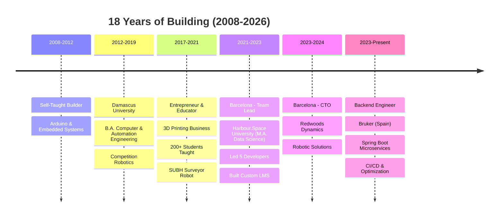

# 🚀 Mazen Hassani

### From Building Robots at 14 to Scaling Microservices at 32

**Backend Engineer @ Bruker | Spain Permanent Resident 🇪🇸 | 18 Years of Building**

---

## 👋 The Journey

I started coding at 14. Not because of school or a bootcamp—just pure curiosity and an Arduino kit.

**18 years later**, that curiosity has taken me from designing PCBs in Damascus to **finishing 9th in the World Robot Olympiad** against 70 countries, from teaching 200+ university students during challenging times to **winning IBM's Call for Code**, from leading dev teams in Barcelona to building Spring Boot microservices in Spain.

I'm not a frontend developer who learned backend, or a backend developer who dabbles in hardware. I'm a **builder** who started at the metal and worked up to the cloud—and I'm equally comfortable at every layer in between.

> **Current mission:** Architecting scalable backend systems at Bruker while staying rooted in the hardware and robotics that started it all.

---

## 🏆 Career Highlights

<table>
<tr>
<td width="50%">

### 🥉 9th Place - WRO World Finals 2018
**Thailand** | 70+ countries
Built autonomous vision-based robot using NI myRIO & LabVIEW
[🎥 Watch Competition](https://youtu.be/Twa7rqZuhAo)

### 🏆 IBM Call for Code 2021
**Regional Winner**
Technology for humanitarian impact

### 🥇 Engineering Design Challenge 2018 & 2019
**American University of Beirut**
Back-to-back champion | Mars Colonization theme
[🎥 Watch EDC 3.0](https://youtu.be/6U5sefCrNyI)

</td>
<td width="50%">

### 🥇 WRO National Champion 2018
**Syria** | Qualified for World Finals

### 🌍 FIRST Global Challenge 2018
**Mexico City** | Energy Impact theme
186 countries, 1,000+ students
[🎥 Watch Competition](https://youtu.be/18wcFPRL9G0)

### 👨‍🏫 Educator & Entrepreneur
Founded 3D printing business
Taught **200+ university students** robotics
Damascus, Syria (2017-2021)

</td>
</tr>
</table>

---

## 💼 Professional Journey

**Current Role:** Backend Software Developer @ **Bruker** (Dec 2023 - Present)
📍 Santiago de Compostela, Spain | 🇪🇸 Spain Permanent Resident

- Architecting **Java Spring Boot microservices** for scientific instruments
- **CI/CD optimization** - reduced deployment time by implementing automated pipelines
- **Query optimization** - improved database performance for high-throughput data processing
- **Document generation automation** - built systems for automated report generation

---

## 🛠️ Technical Expertise

I've spent 18 years building from the metal to the cloud. Here's what that looks like:

### ⚙️ Backend & Systems

**Architecture:** Microservices • Monolith Design • Performance Optimization • Query Optimization

### 🚀 DevOps & Cloud

**Expertise:** CI/CD Pipelines • Infrastructure as Code • Load Balancing • Deployment Automation

### 🤖 Robotics & Embedded (Where It All Started)

**Hardware:** 30+ Custom PCB Designs (Eagle CAD) • Motor Control • Computer Vision (OpenCV) • Inverse Kinematics • UWB Positioning • 3D Printing & Manufacturing

### 🌐 Full-Stack Web

**Experience:** Custom LMS Development • RESTful APIs • Real-time Systems

### 📊 Data Science & AI

**Education:** M.A. Data Science (Harbour.Space University, 2021-2023) • Machine Learning • Statistical Analysis • Big Data

---

## 🚀 Featured Projects

### 🏅 Competition Champions

<table>
<tr>
<td width="50%">

#### 🥉 WRO 2018 - Tetrastack (9th in World)
**NI myRIO • LabVIEW • Computer Vision • TETRIX**

Autonomous robot that located, identified, and stacked colored Tetris-like shapes using advanced computer vision. Competed against 70+ countries in Thailand.

**Key Innovation:** Real-time shape recognition with binary thresholding and autonomous manipulation.

[🎥 Watch Competition](https://youtu.be/Twa7rqZuhAo) | [📁 Code](https://github.com/mazen-hassani/wro-2018-tetris-challenge)

</td>
<td width="50%">

#### 🥇 EDC 3.0 - Mars Challenge (1st Place, $1,500)
**Control Theory • ML • Navigation • Computer Vision**

Autonomous robot tackling Mars colonization challenges at AUB. First place out of university teams across MENA region.

**Key Innovation:** Advanced control systems integrating ML for navigation in simulated Mars environment.

[🎥 Watch Competition](https://youtu.be/6U5sefCrNyI) | [📁 3D Model](https://github.com/mazen-hassani/edc-3d-model)

</td>
</tr>
</table>

### 🦾 Advanced Robotics

<b>🗺️ SUBH Surveyor Robot</b> - Indoor positioning & mapping with UWB technology

**DWM1000 UWB Modules • Mecanum Wheels • Arduino • IMU Sensors**

Built an indoor surveying robot using ultra-wideband beacons for GPS-like positioning indoors with centimeter-level accuracy. Features omnidirectional movement with mecanum wheels.

**Impact:** Demonstrated feasibility of affordable indoor positioning for surveying applications.

[📁 Repository](https://github.com/mazen-hassani/subh-surveyor-robot) | [📁 UWB Adapter PCB](https://github.com/mazen-hassani/dwm1000-arduino-adapter)

<b>🕷️ Quadruped Spider Robot</b> - 12-servo walking robot with inverse kinematics

**Feetech Serial Servos • Arduino Mega • Inverse Kinematics • Gait Control**

4-legged walking robot with 3 DOF per leg (12 servos total). Implements inverse kinematics for precise 3D leg positioning and smooth walking gaits. Includes gestures like waving, handshaking, sitting, and standing.

**Technical Achievement:** 50Hz servo update rate via timer interrupts with Cartesian-to-polar coordinate transformation.

[📁 Repository](https://github.com/mazen-hassani/quadruped-robot)

<b>♟️ Chess Robot</b> - Physical chess piece manipulation

**Arduino • HiTechnic Motor Controllers • I2C Protocol**

Robot that physically moves chess pieces on a board. Arduino acts as I2C master communicating with LEGO NXT motor controllers.

**Technical Hack:** TWI clock speed reduced to ~9.6 kHz to trick HiTechnic controllers into thinking Arduino is an NXT brick.

[📁 Repository](https://github.com/mazen-hassani/chess-robot)

### 💼 Professional Systems

<b>🎓 Harbour.Space Custom LMS</b> - Led team building university platform from scratch

**Laravel • Vue.js • CI/CD • Team of 5**

As **Team Lead & Web Developer**, led development of a complete Learning Management System from scratch for Harbour.Space University. Integrated 6 years of academic data and managed CI/CD pipelines.

**Impact:** Production system serving entire university, handling course management, student records, and academic workflows.

**Role:** Team Lead (Jan 2021 - Dec 2023)

### 🔧 Hardware & Manufacturing

<b>🎨 30+ Custom PCB Designs</b> - Eagle CAD boards for embedded projects

**Eagle CAD • PCB Design • Manufacturing**

Designed 30+ custom PCBs including:
- Arduino boards (Pro Mini, Uno clones, ATmega32u4 breakout)
- ESP8266 modules (multiple breakout variants)
- Motor drivers (4WD driver board)
- USB-to-serial adapters (FTDI-based)
- **Jasmin City AVR Programmer** - PCB shaped like jasmin flower 🌸 (Syrian contribution to open-source hardware community!)

**Impact:** Functional prototypes for competition robots, educational projects, and commercial products.

[📁 Eagle Designs Collection](https://github.com/mazen-hassani/eagle-pcb-designs) | [📁 Jasmin City](https://github.com/mazen-hassani/jasmin-city)

<b>🖨️ 3D Printing Business</b> - Founded and operated during university years

**Manufacturing • Business Operations • Education**

Founded 3D printing business specializing in robotics parts during challenging times in Syria (2017-2021). Manufactured parts for robotics projects and educational kits.

**Impact:** Enabled local robotics community with affordable custom parts while teaching 200+ university students.

---

## 📈 GitHub Stats

**97 Repositories** spanning robotics, backend, web, AI, embedded systems, and PCB design

---

## 📚 Education

🎓 **Master of Arts in Data Science**
Harbour.Space University, Barcelona, Spain (2021-2023)

🎓 **Bachelor of Arts in Computer & Automation Engineering**
Damascus University, Syria (2012-2019)

---

## 🌍 About Me

- 🇪🇸 **Based in:** Santiago de Compostela, Spain (Permanent Resident)
- 🌐 **Languages:** English (fluent) • Arabic (native) • Spanish (beginner)
- 🏆 **Philosophy:** Build things that matter, compete to grow, teach to solidify knowledge
- 🔭 **Currently:** Scaling microservices at Bruker while staying sharp on robotics fundamentals
- 🌱 **Always learning:** Exploring Rust for systems programming, advancing Spanish language skills
- ⚡ **Fun fact:** I've designed more PCBs (30+) than most backend engineers have seen in their careers

---

## 🤝 Let's Connect

I'm always interested in challenging backend/systems roles, robotics projects, or technical leadership opportunities.

📞 **+34 653 57 00 79** (Spain) | **+971 56 774 9738**

---

### 💡 From Arduino at 14 to microservices at 32—still building, still learning, still shipping.

**18 years of proof: the best engineers are the ones who never stopped being curious builders.**

